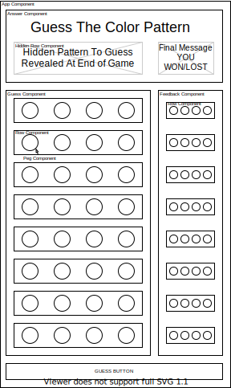

This project idea is based off of the board game [Mastermind](https://en.wikipedia.org/wiki/Mastermind_(board_game))

The idea of the project is to have the project state across a few components while highlighting the ability to access data and dispatch actions from nested components. This wireframe shows up to 4 levels of nesting where the plan is to access dat and dispatch actions from the lowest components in the tree.



A game starts with the creation of the `answer`, a random pattern of colors across four "pegs" (the board game uses pegs for the colors) and saved in the state. `round` is also in the state and set to 1.

The user must guess a color pattern by cycling each peg in the active `guess row component`. When the submit button is pressed feedback will be delivered to the neighboring `feedback row component`. 
- The feedback peg is black if the associated guessed peg is the correct color and in the correct position. 
- The feedback peg is white if the associated guessed peg is the correct color but in the wrong position.
When the game ends, the answer will be revealed and a message will be revealed based on if the user guessed the pattern or used up all their rounds.

The proposed App structure:
App Component
|- Answer Component
|- Guess Component
|--- Guess Row x8
|----- Guess Peg x4
|- Feedback Component
|--- Feedback Row x8
|----- Feedback Peg x4

The proposed state:
```
state = {
  answer = {1: color, 2: color, 3: color, 4: color}, // answer component
  round = 1, // answer component
  gameover: false, // answer component
  guesses = { // guess component
    // guesses[round][color]
    1: {1: color, 2: color, 3: color, 4: color},
    2: {1: color, 2: color, 3: color, 4: color},
    3: {1: color, 2: color, 3: color, 4: color},
    4: {1: color, 2: color, 3: color, 4: color},
    5: {1: color, 2: color, 3: color, 4: color},
    6: {1: color, 2: color, 3: color, 4: color},
    7: {1: color, 2: color, 3: color, 4: color},
    8: {1: color, 2: color, 3: color, 4: color},
  },
  feedback = { // feedback component
    // feedback[round][color]
    1: {1: color, 2: color, 3: color, 4: color},
    2: {1: color, 2: color, 3: color, 4: color},
    3: {1: color, 2: color, 3: color, 4: color},
    4: {1: color, 2: color, 3: color, 4: color},
    5: {1: color, 2: color, 3: color, 4: color},
    6: {1: color, 2: color, 3: color, 4: color},
    7: {1: color, 2: color, 3: color, 4: color},
    8: {1: color, 2: color, 3: color, 4: color},
  },
}
```
Selectors:
- Answer Component
  - selectAnswer: used to decide feedback and to reveal pattern at the end of the game.
  - selectRound: used to know which rows to "activate" and when the game ends.
  - selectGameOver: used to display the answer and correct message.
- Guess Component and Feedback Components have no selectors. The pegs will use inline selectors since they need to pass their location `[roundNumber][pegNumber]` to select the right data.


Actions dispatched:
- From each guess peg, to cycle colors
- The "Submit Guess" button to check guess
- Feedback Component to, set feedback and advance round or signal correct answer (game over).

